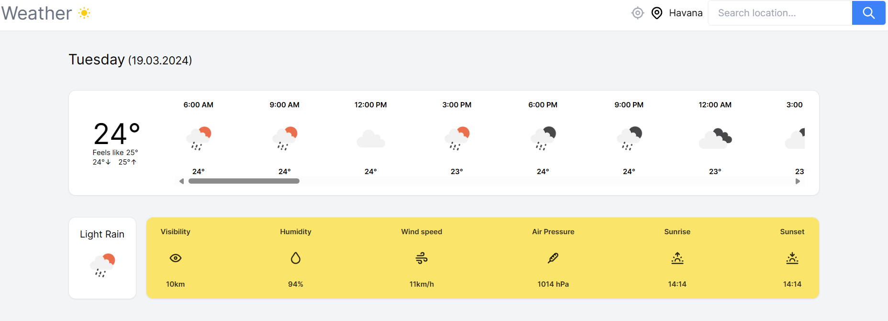

# Weather App - Next.js



> Osvaldo R. Moreno Prieto. 2024

## Install dependencies

```bash
yarn
```

## Run the app

```
yarn dev
```

## Deploy

**[https://weather-app-osvaldo-r-moreno-ps-projects.vercel.app/](https://weather-app-osvaldo-r-moreno-ps-projects.vercel.app/)**

## Description

This is a simple weather app built with Next.js and Tailwind CSS. It uses the OpenWeatherMap API to fetch weather data. The app is deployed on Vercel.

Video tutorial: https://www.youtube.com/watch?v=KkC_wYM_Co4
